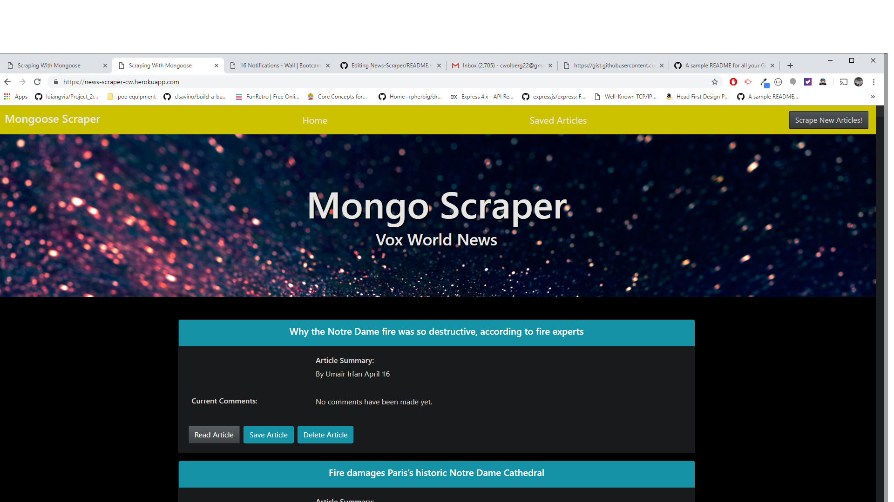
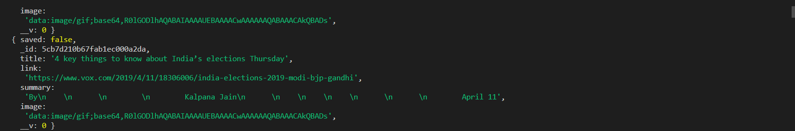

# News-Scraper

This app will scrape stories from Vox News and display them for the user. Each scraped article is saved to the application database. The app scrapes and displays the headline, author summary, and article url for the user. It also allows the user to save and view favorite articles

[Link to Demo](https://news-scraper-cw.herokuapp.com/)


# App Preview



## File Structure

```
├── controllers
|  ├── fetch.js
|  ├── headline.js
|  └── note.js
├── models
|  ├── Article.js
|  ├── index.js
|  └── Note.js
├── public
|  └── assets
|      └── img
|      └── css
|  └── app.js
└── views
|  ├── index.handlebars
|  └── saved.handlebars
|  └── layouts
|     └── main.handlebars
├── package-lock.json
├── package.json
└── README.md
└── server.js
```


### Dependancies


```
    "axios": "^0.18.0",
    "body-parser": "^1.18.3",
    "cheerio": "^1.0.0-rc.3",
    "express": "^4.16.4",
    "express-handlebars": "^3.0.2",
    "mongoose": "^5.5.2",
    "morgan": "^1.9.1",
    "request": "^2.88.0"
```


TODOS: 

FIX COMMENTS

FIX ARTICLE IMAGES



